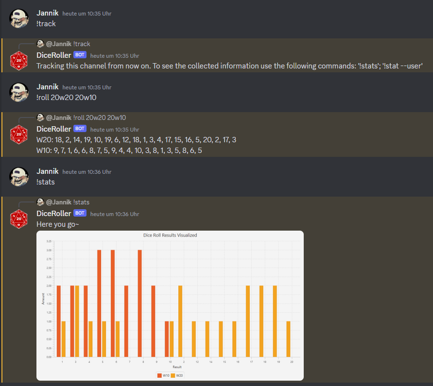

# DiscordDiceRoller

This is a small project for me and my friends to add a small private bot for rolling dice and keeping track on what was
rolled.
Using gradle you can build and package the bot into a runnable jar

``` gradle
    gradle jar
```

which will generate the jar file. You can find it here:

```
    build/libs/DiceRollBot-VERSION-SNAPSHOT.jar
```

## Setup

The bot needs a **.env**-file in the cwd. That file needs to contain the token for your discord bot so you can connect
via the discord API.

```.env
    TOKEN=YOUR_TOKEN_HERE
```

After that you can simply run the bot:

```shell
    java -jar path/to/jar
```

Keep in mind that the .env file needs to be in the current working directory (cwd).

### Usage

After you have added the bot to your discord server / guild of choice you can use it in the following way:

```discord
    !roll w20
```

```discord
    !roll 5w20 6w4 1w6
```

The bot will respond with the results of your rolls to the original message.

## Graphs

This bot has uses JavaFX to generate graphs. These graphs are an overview of the rolled values per die in a tracked
channel.
You have to start the tracking of a certain channel.

```discord
    !track
```

Then you just use the bot to roll numbers. You can then use the following commands to see an overview of the rolls:

```discord
    !stats
```

```discord
    !stats --user
```

Both show the results in a similar way. The --user flag filters out the results for only the user that ran the command
in this channel.
This is not working across channels!

The results should then look similar to this: 